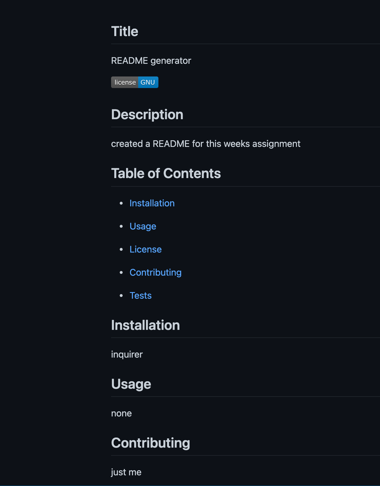

# Professional-README-Generator

Fot this weeks assignment i created a README generator. The reason for this is so that I can quickly create a professional README for a new project.

● First I did npm init and installed package.json and NPM install to get the inquirer package.

● Then I created an array of questions for user input for some questions and tested it.

● Created a function to write README file and finished the init function

● Created markdown for 3 array questions and tested it and was able to write readme

● Created a question for installation and rendered it on generate markdown function

● Completed the array of questions and rendered it on the function

● Created a function that returns the license section of README

Deployed Link: https://anuur7.github.io/Professional-README-Generator/

Link for recording: https://drive.google.com/file/d/11u-pZyUSm5Zn1rUqbDgZTI8xrjBDlcqu/view?usp=sharing

